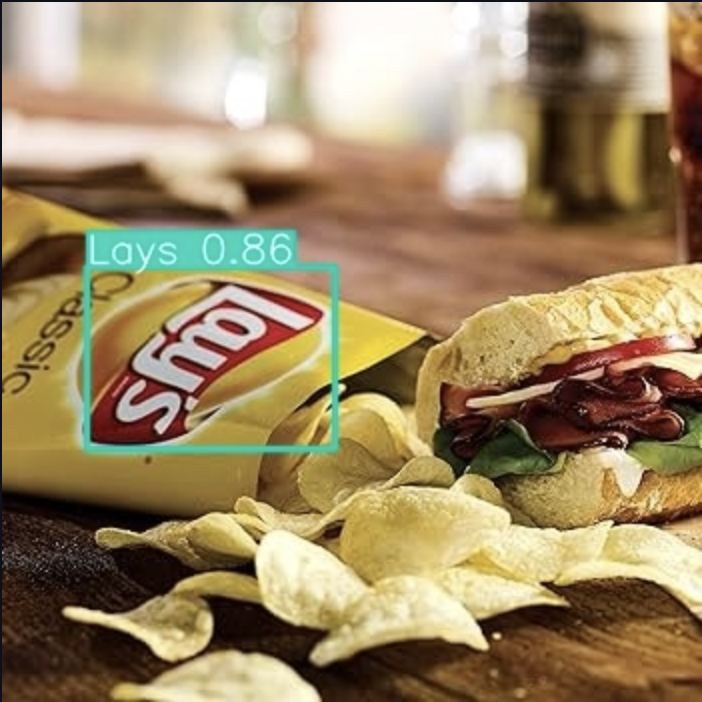

# Aplicación Web de Detector de Papas Lays usando YOLOv9 y Streamlit

<p align="center">
  
</p>

<p align="center">
  <b>En Tiempo Real usando tu cámara, subiendo una imagen o vídeo</b>
</p>

---

## Tabla de Contenidos
1. [Introducción](#introducción)
2. [Características](#características)
3. [Instalación](#instalación)
4. [Uso](#uso)
5. [Demostración](#demostración)
6. [Tecnologías Utilizadas](#tecnologías-utilizadas)
7. [Contribuciones](#contribuciones)
8. [Licencia](#licencia)
9. [Agradecimientos](#agradecimientos)

## Introducción

<p align="center">
  
</p>

Este proyecto tiene como objetivo crear un detector en tiempo real de bolsas de papas Lay's utilizando técnicas de aprendizaje profundo. Al analizar imágenes de video, el modelo identifica y clasifica las bolsas de papas Lay's. La aplicación está construida con YOLOv9 para la detección de objetos y Streamlit para la interfaz web.

## Características

- **Detección en tiempo real**: Transmite entrada de video y obtén resultados de detección de papas Lay's instantáneos.
- **Interfaz fácil de usar**: Fácil de usar, no se requiere experiencia en aprendizaje profundo.
- **Análisis detallado**: Representación visual de las detecciones.

## Instalación

Para poner en marcha este proyecto localmente, sigue estos pasos:

1. **Clona el repositorio**:
    ```bash
    git clone https://github.com/tu-usuario/lays-detector-app.git
    cd lays-detector-app
    ```

2. **Crea un entorno virtual**:
    ```bash
    python3 -m venv venv
    source venv/bin/activate  # En Windows usa `venv\Scripts\activate`
    ```

3. **Instala las dependencias**:
    ```bash
    pip install -r requirements.txt
    Agrega el archivo package.txt

4. **Ejecuta la aplicación**:
    ```bash
    streamlit run app.py
    ```

## Uso

Para usar la aplicación, simplemente ejecuta el comando anterior y abre tu navegador web en `http://localhost:8501`. Desde allí, puedes comenzar a transmitir video y el modelo lo procesará en tiempo real para detectar bolsas de papas Lay's.

<p align="center">
  
</p>

## Demostración

Consulta una demostración en vivo de la aplicación [aquí](https://tu-url-de-demo.com).

<p align="center">
  
</p>

## Tecnologías Utilizadas

- **YOLOv9**: Para la detección de objetos en tiempo real.
- **Streamlit**: Para construir una interfaz web interactiva.
- **OpenCV**: Para el procesamiento de video.
- **Python**: El lenguaje de programación principal del proyecto.

## Contribuciones

¡Las contribuciones son bienvenidas! Por favor, lee nuestras [directrices de contribución](CONTRIBUTING.md) antes de enviar una solicitud de extracción.

## Licencia

Este proyecto está licenciado bajo la Licencia MIT - consulta el archivo [LICENSE](LICENSE) para más detalles.

## Agradecimientos

Agradecimientos especiales a:
- [Streamlit](https://www.streamlit.io/)
- [YOLOv9](https://github.com/ultralytics/yolov9)
- La comunidad de código abierto por sus herramientas y recursos invaluables.

---

<p align="center">
  
</p>
